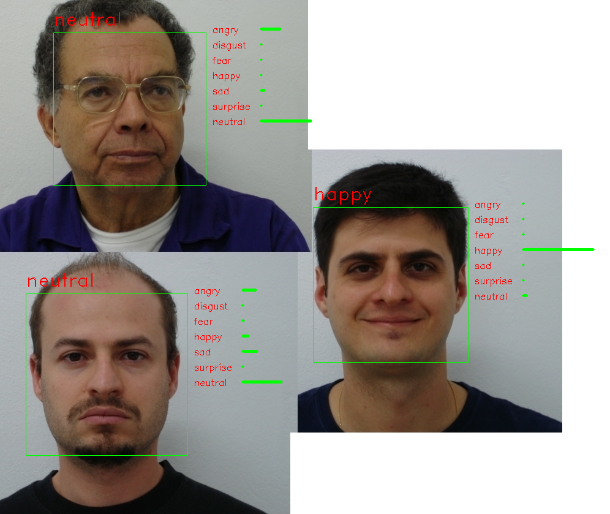

# Facial emotion recognition

C++ implementation for facial emotion recognition according to [Arriaga's Keras model](https://github.com/oarriaga/face_classification).  
The CNN weights were converted from the pretrained model [fer2013_mini_XCEPTION.102-0.66.hdf5](https://github.com/oarriaga/face_classification/blob/master/trained_models/emotion_models/fer2013_mini_XCEPTION.102-0.66.hdf5)  
The code was adapted from an example on Caffe repository.

## Tested system
* Ubuntu 16.04
* OpenCV 3.4.2
* Nvidia Caffe

## Usage
```
$ ./emotion_recognition.bin --image=path/to/image \
                            --video=path/to/video \
                            --net-proto=path/to/prototxt \
                            --net-weight=path/to/caffeweight \
                            --net-labels=path/to/labels \
                            --detector=path/to/haarcascade
```

## Example
Performing emotion recognition using default model
```
$ ./emotion_recognition.bin --image=image.jpg
```

Result (with images from [FEI face database](https://fei.edu.br/~cet/facedatabase.html))

